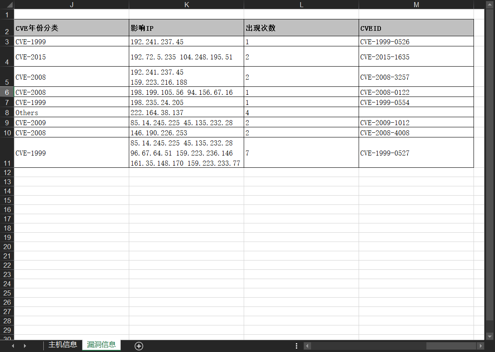
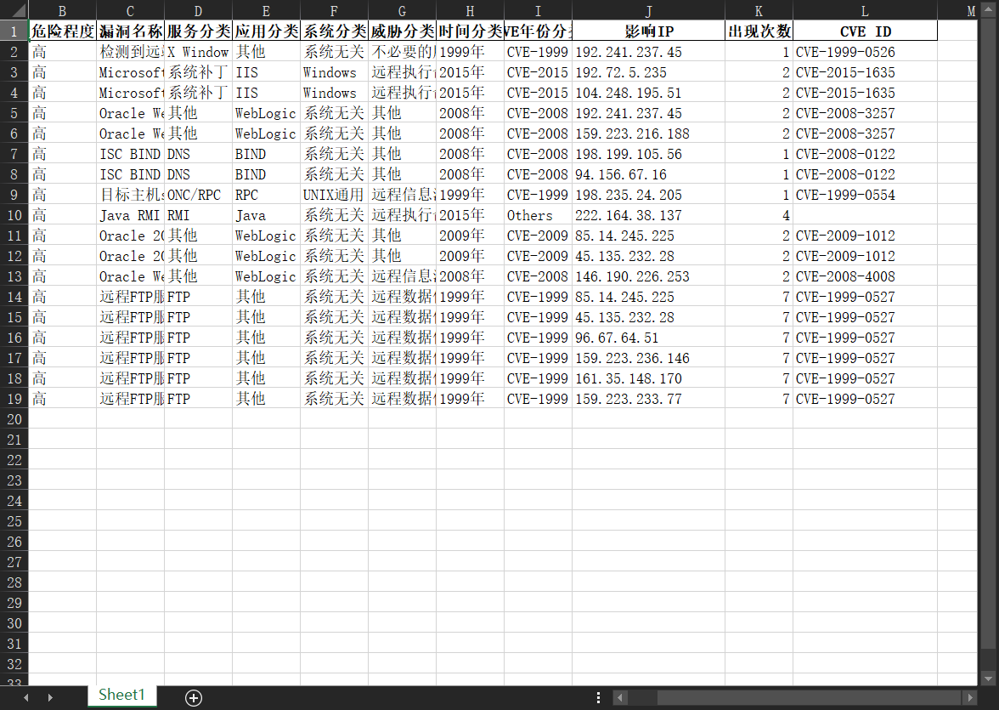

绿盟的漏扫汇总表居然只能按照“漏洞”分类，所有相同漏洞的IP都挤在一个单元格内。
最要命的是同一个IP对应不同漏洞，单元格内有大量重复IP。这就导致无法使用VLookUP函数匹配。

而且绿盟产品说没有“按IP”分类的模板，限制死了。所以我无法提取每个IP对应的漏洞信息。

Office与WPS这种表格文档的计算都是横向的，有单元格分列，这种单元格分行没有。

如下图

也无法将IP匹配资产所属。我们省局为了督促各市局，怎么能不想办法下发呢

于是就有了这个脚本，直接把文件拖拽到exe上就会展开，如下图

只是展开“影响IP”列，左右单元格信息完全一致，这样就达到了按IP分类，你问我为什么不把每个IP对应的CVE放一个单元格做汇总？因为其余列还有“漏洞描述”和“修复建议”，这样都挤在一起不好。

我打包为exe以便发给其他同事用，使用者可以修改源码里的拖拽事件、插入位置、重命名列名等等内容，以便自己使用。打包建议虚拟环境 + UPX

参考链接：https://blog.csdn.net/qq_27283619/article/details/96164836